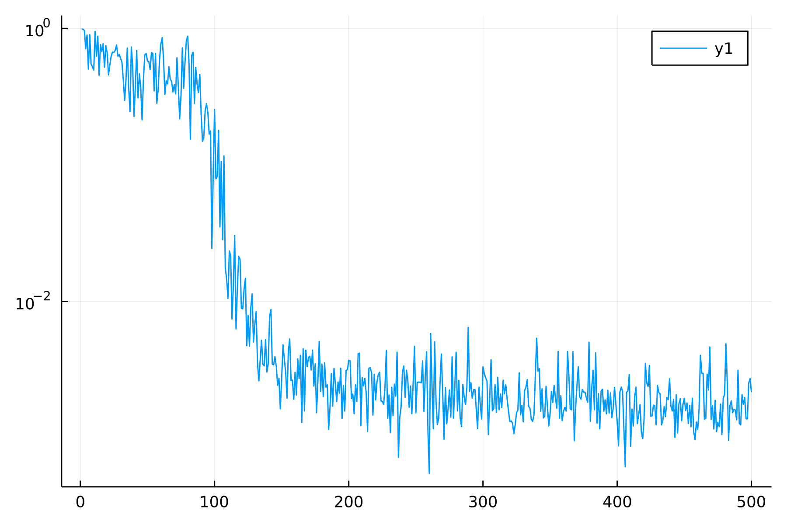
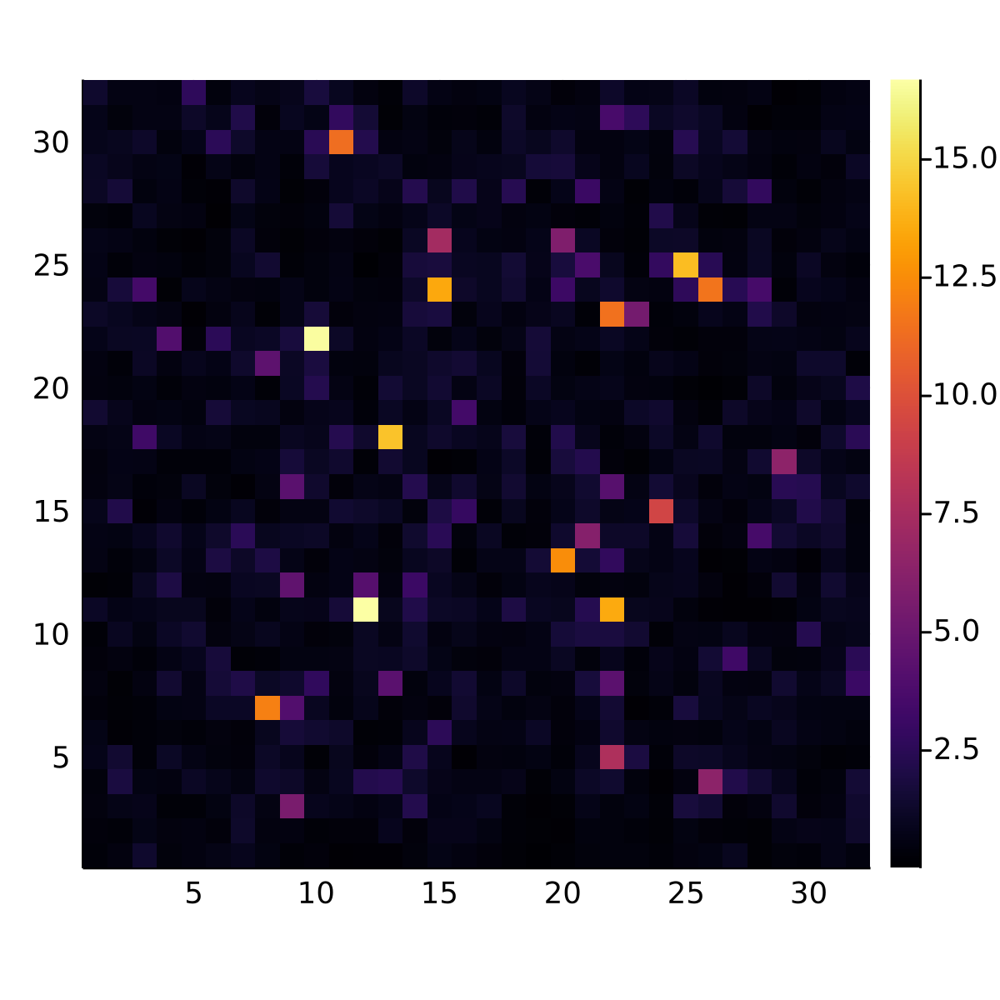

# ImagingOpt

## Prerequisites

Clone [WavePropagation.jl](https://github.com/gaurav-arya/WavePropagation.jl), [ImplicitAdjoints.jl](https://github.com/gaurav-arya/ImplicitAdjoints.jl) and this repo and run
```
dev {path to WavePropagation.jl}
dev {path to ImplicitAdjoints.jl}
dev {path to this repo}
```
in Julia's package manager.

## Directory structure

- Code is in `src`
    - `src/forward.jl` defines the linear operator `G` which convolves with all the PSFs.
    - `src/pipeline.jl` makes a differentiable pipeline using the physics functions from `WavePropagation.jl`, the Lasso reconstruction function from `ImplicitAdjoints.jl`, and the linear operator from `src/forward.jl`. Everything is composed together in the function `loss`.
    - `src/prepare.jl` defines the format of all the input parameters and has utility functions for doing all the precomputation required before optimization.
    - `src/optimize.jl` provides some functions for running an optimization given the name of a JSON file with parameters.
- Parameter files describing an imaging optimization problem are expected in `params`.
- Surrogate data (generated from Python) is expected in `surdata`.
- Optimization data is saved in `optdata`.

## Example

A toy example small enough to easily run on a laptop:

```
using ImagingOpt
using Plots

optname = run_opt("2dsmall")

smalls = get_smalls(optname) # concise info about each iteration
MSEs = [small["res"].MSE for small in smalls]
plot(MSEs, yaxis=:log, dpi=300)

raw = get_raw(optname) # all the raw data (psfs, etc.) from a single iteration (default is last iteration).
PSF = raw["res"].PSFs[:,:,1,1,1] # only 1 channel so only 1 PSF (indices are x,y,depth,frequency,configuration)
heatmap(PSF, aspect_ratio=:equal, size=(400,400), dpi=300)
```

 
 
